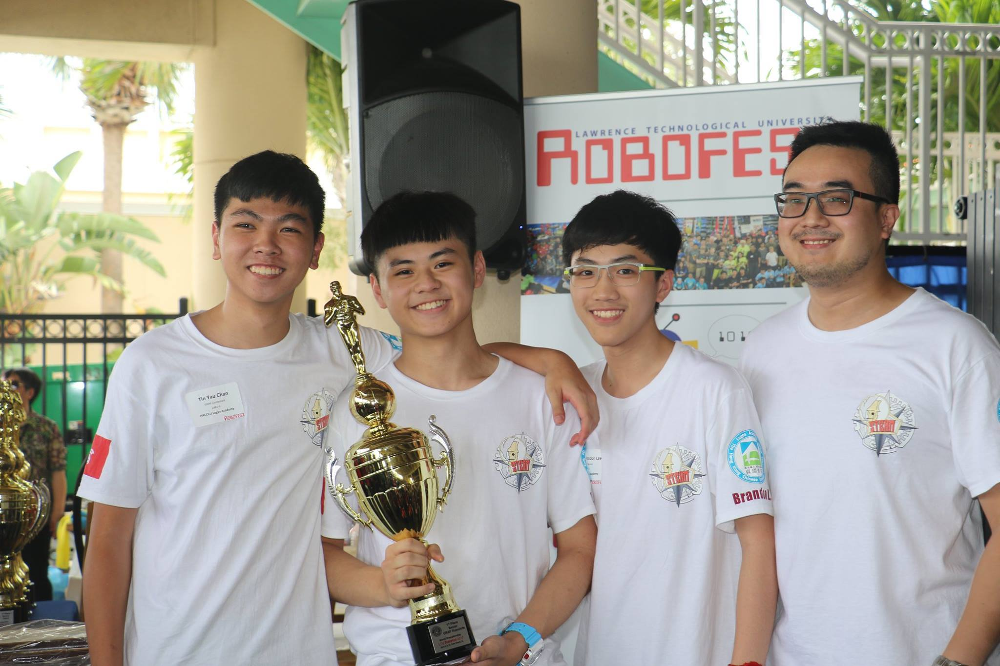
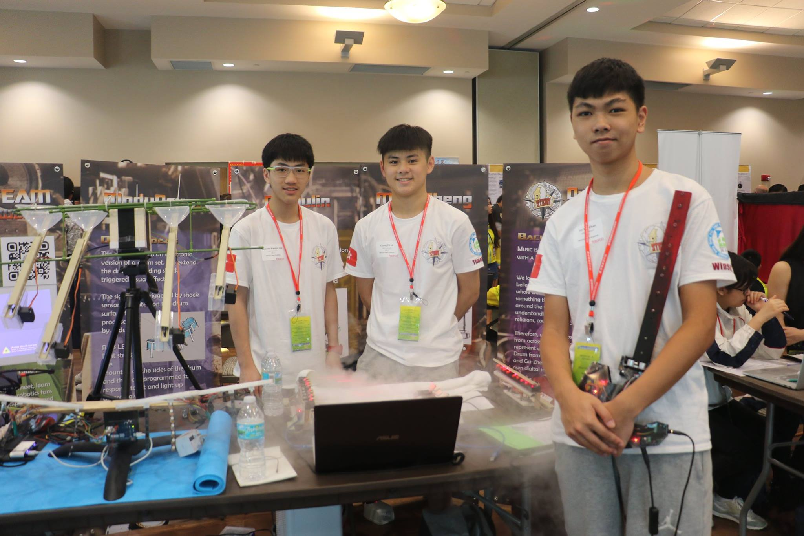

# RoboFest 2017

**RoboFest**, hosted by Lawrence Technological University in Southfield, MI, is a festival of competitions and events with autonomous robots that encourages students to have fun while learning principles of Science, Technology, Engineering, and Math (**STEM**), and Computer Science.

# What is GRAF

**Global Robotics Art Festival** (now renamed to RoboArts) is a competition based on visual and/or performing arts. Participants program robots to be interactive and intelligent using sensory components and microcontrollers.

# Awards

-   Official RoboFest GRAF World Champion
-   People's Choice Award (public voting)

# Our Robots

My teammates and I were all **music enthusiasts**, so we decided we would build musical instruments with our touch of robotics and science. The robots we made include a _string-less violin, laser harp, and a marble midi drum_.

[Robofest 2017 Logos Website](https://logossteampowered.wixsite.com/2017robofest)

## String-less Violin

The string-less violin uses **ultrasonic sensors** to detect the relative position of the player's hand on the neck of the violin. The distance is fed to a pair of Arduinos that would select the corresponding frequency and generate a electric signal of said frequency. The signal is passed through a **in-built amplifier** and played through a speaker.

## Laser Harp

8 **class A laser emitters and receivers** are reused to recreate the strings of a harp. Each laser is pointed directly to the receiver. If any of the receivers stop receiving a signal, the Arduino that is connected to all the receivers will trigger a **serial signal to a connected computer** to play a sound sample. This mimics the act of plucking a string on a harp.

## Marbles Midi-Drum

Attached to 4 custom made drum pads are 4 **shock sensors** that can detect any impact on the drum pad surface. A serial signal is triggered from an Arduino to a laptop to play a select drum sample.

A marble dropping machine is made will be ability to **program any marble dropping sequence**, which will act as if a drummer were playing the drum pads with sticks.
